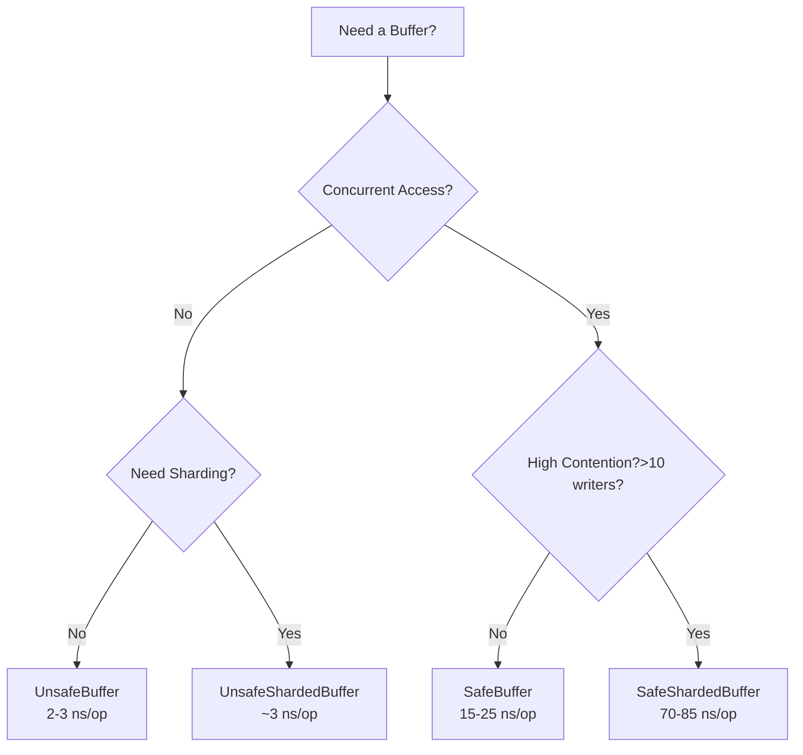

# kbuffer - High-Performance Kernel Buffer Package

Ultra-optimized byte buffer implementations with explicit thread-safety
selection for kernel-level operations.

## Table of Contents

- [Overview](#overview)
- [Architecture](#architecture)
- [Buffer Types](#buffer-types)
- [Quick Start](#quick-start)
- [Performance Characteristics](#performance-characteristics)
- [Usage Guidelines](#usage-guidelines)
- [Advanced Features](#advanced-features)
- [Best Practices](#best-practices)
- [Testing](#testing)
- [Build Configuration](#build-configuration)

## Overview

The kbuffer package provides four distinct buffer implementations, each
optimized for specific concurrency and performance requirements:

| Buffer Type             | Thread-Safe | Performance | Use Case                             |
| ----------------------- | ----------- | ----------- | ------------------------------------ |
| **UnsafeBuffer**        | ❌ No       | 2-3 ns/op   | Single-threaded, maximum performance |
| **SafeBuffer**          | ✅ Yes      | 15-25 ns/op | Low-moderate concurrency             |
| **UnsafeShardedBuffer** | ❌ No       | ~3 ns/op    | Single-threaded with sharding needs  |
| **SafeShardedBuffer**   | ✅ Yes      | 70-85 ns/op | High concurrency (10+ writers)       |

### Key Features

- **Zero allocations** in hot paths
- **CPU cache-line aligned** structures (64 bytes)
- **Lock-free reads** where possible
- **Explicit safety choice** - no hidden synchronization costs
- **Goroutine safety checks** in development builds
- **Power-of-2 size classed pooling** for efficient memory reuse

## Architecture

### Design Principles

1. **Explicit Safety**: Every buffer creation requires choosing between `Unsafe`
   (no synchronization) or `Safe` (thread-safe) variants
2. **Performance First**: Extensive use of `unsafe` package for zero-copy
   operations
3. **Cache Optimization**: Careful memory layout to prevent false sharing
4. **Scalability**: Sharded variants for high-contention scenarios

### Memory Layout

All buffer structures are carefully designed for optimal cache performance:

```go
// Cache line 1 (64 bytes) - Hot path fields
data unsafe.Pointer  // Direct pointer to byte array
len  uint32         // Current length
cap  uint32         // Buffer capacity
flag uint32         // Status flags
_    [44]byte       // Padding to prevent false sharing

// Cache line 2 (64 bytes) - Cold path fields
// Metadata and safety checks
```

## Buffer Types

### UnsafeBuffer - Maximum Performance

**NOT THREAD-SAFE** - Use only in single-threaded contexts.

```go
buf := kbuffer.NewUnsafeBuffer(4096)
buf.WriteString("blazing fast")
data := buf.Bytes() // Zero-copy access
```

**Performance**: 2-3 ns/op for writes **Use Cases**:

- Request-scoped buffers
- Protocol parsing
- Serialization/deserialization
- Single-threaded algorithms

### SafeBuffer - Thread-Safe with Spinlock

**THREAD-SAFE** - Safe for concurrent access.

```go
buf := kbuffer.NewSafeBuffer(4096)
// Safe for concurrent writes
go buf.Write([]byte("goroutine 1"))
go buf.Write([]byte("goroutine 2"))
```

**Performance**: 15-25 ns/op for writes **Use Cases**:

- Shared logging buffers
- Concurrent data collection
- Low to moderate contention (≤10 writers)

### UnsafeShardedBuffer - Single-Threaded Sharding

**NOT THREAD-SAFE** - Sharding without synchronization overhead.

```go
buf := kbuffer.NewUnsafeShardedBuffer(65536, 8) // 64KB, 8 shards
// Write to specific shards
buf.WriteToShard(0, []byte("shard 0 data"))
buf.WriteToShard(1, []byte("shard 1 data"))
buf.Balance() // Redistribute data evenly
```

**Performance**: ~3 ns/op for writes **Use Cases**:

- Cache-optimized algorithms
- Data partitioning for future parallelization
- MapReduce-style single-threaded processing

### SafeShardedBuffer - High-Concurrency Champion

**THREAD-SAFE** - Optimized for high contention.

```go
buf := kbuffer.NewSafeShardedBuffer(1048576, 16) // 1MB, 16 shards
// Handles 100+ concurrent writers efficiently
var wg sync.WaitGroup
for i := 0; i < 100; i++ {
    wg.Add(1)
    go func(id int) {
        defer wg.Done()
        for j := 0; j < 1000; j++ {
            buf.WriteString(fmt.Sprintf("G%d-M%d\n", id, j))
        }
    }(i)
}
wg.Wait()
```

**Performance**: 70-85 ns/op even with 100 goroutines **Use Cases**:

- High-throughput logging
- Multi-producer queues
- Concurrent metrics collection
- Any scenario with >10 concurrent writers

## Quick Start

### Basic Operations

```go
package main

import "github.com/your-org/kbuffer"

func main() {
    // Choose your buffer based on needs
    buf := kbuffer.NewSafeBuffer(1024)

    // Write operations
    buf.Write([]byte("hello"))
    buf.WriteString(" world")
    buf.WriteByte('!')

    // Read operations
    data := buf.Bytes()     // Get as []byte
    str := buf.String()     // Get as string

    // Buffer management
    length := buf.Len()           // Current data length
    capacity := buf.Cap()         // Total capacity
    available := buf.Available()  // Remaining space

    buf.Reset()  // Clear data, keep capacity
    buf.Clear()  // Zero memory and reset
}
```

### Using Buffer Pools

```go
// Create application-managed pool
pool := kbuffer.NewPool()
pool.SetClearOnPut(true)     // Security: clear on return
pool.SetMaxSize(4 << 20)      // Max 4MB per buffer

// Get and return raw slices
buf := pool.Get(1024)
defer pool.Put(buf)
// ... use buf ...

// Get and return Buffer instances
buffer := pool.GetBuffer(1024)
defer pool.PutBuffer(buffer)
// ... use buffer ...
```

## Performance Characteristics

### Write Performance Comparison

| Scenario        | UnsafeBuffer | SafeBuffer    | SafeShardedBuffer |
| --------------- | ------------ | ------------- | ----------------- |
| Single-threaded | 2-3 ns/op    | 15-25 ns/op   | 70-85 ns/op       |
| 2 goroutines    | ❌ PANIC     | 20-30 ns/op   | 75-90 ns/op       |
| 10 goroutines   | ❌ PANIC     | 100-150 ns/op | 80-95 ns/op       |
| 100 goroutines  | ❌ PANIC     | 500-800 ns/op | 85-100 ns/op      |

### Memory Characteristics

- **Zero allocations** after buffer creation
- **Direct memory access** for unsafe variants
- **Copy-on-read** for safe variants (Bytes() method)
- **Power-of-2 growth** strategy for dynamic expansion

## Usage Guidelines

### Choosing the Right Buffer



### Shard Count Recommendations

For SafeShardedBuffer:

- **Light contention** (2-10 goroutines): 4-8 shards
- **Moderate contention** (10-50 goroutines): 16 shards
- **Heavy contention** (50+ goroutines): 32-64 shards
- **Rule of thumb**: 2-4x the number of concurrent writers

### When to Use Sharding

Sharding is beneficial when:

- You have >10 concurrent writers
- Write contention exceeds 10% in profiles
- You need predictable latency under load
- Data can be logically partitioned

## Advanced Features

### Direct Shard Access

```go
sharded := kbuffer.NewSafeShardedBuffer(8192, 4)

// Write to specific shard
sharded.WriteToShard(0, []byte("shard 0"))

// Get shard count
count := sharded.ShardCount() // Returns 4

// Rebalance after skewed writes
sharded.Balance()
```

### Zero-Copy Operations (Unsafe Only)

```go
unsafe := kbuffer.NewUnsafeBuffer(1024)

// Direct memory access
ptr, length := unsafe.BytesUnsafe()

// Zero-copy string conversion
str := unsafe.String() // Shares memory with buffer

// Access remaining capacity directly
remaining := unsafe.RemainingSlice()
```

### Non-Blocking Writes

```go
buf := kbuffer.NewSafeBuffer(1024)

// Try to write without blocking
if buf.TryWrite(data) {
    // Write succeeded
} else {
    // Buffer is locked or full
}
```

## Best Practices

### DO ✅

- **Choose explicitly** between Safe and Unsafe variants
- **Use pools** for frequently allocated buffers
- **Reset buffers** for reuse instead of allocating new ones
- **Use sharding** for high-contention scenarios
- **Profile your code** to verify performance assumptions
- **Clear sensitive data** with Clear() method

### DON'T ❌

- **Don't use UnsafeBuffer** with goroutines
- **Don't over-shard** (diminishing returns beyond CPU cores)
- **Don't pool huge buffers** (>4MB)
- **Don't ignore goroutine safety warnings** in development
- **Don't share Bytes() slices** from unsafe buffers across goroutines

### Security Considerations

```go
// For sensitive data
pool := kbuffer.NewPool()
pool.SetClearOnPut(true) // Zero memory on return

buf := pool.GetBuffer(1024)
buf.WriteString(sensitiveData)
buf.Clear() // Explicitly zero memory
pool.PutBuffer(buf)
```

## Testing

### Unit Tests

```bash
# Run all tests with safety checks (default)
go test ./pkg/kernel/kbuffer/...

# Run with race detector
go test -race ./pkg/kernel/kbuffer/...

# Run specific test
go test -run TestSafeBuffer ./pkg/kernel/kbuffer/...

# Check coverage
go test -cover ./pkg/kernel/kbuffer/...
```

### Benchmarks

```bash
# Run all benchmarks
go test -bench=. ./pkg/kernel/kbuffer/...

# Run specific benchmark
go test -bench=BenchmarkSafeShardedBuffer ./pkg/kernel/kbuffer/...

# Run with memory profiling
go test -bench=. -benchmem ./pkg/kernel/kbuffer/...

# Production mode (no safety checks)
go test -tags=unsafe_no_check -bench=. ./pkg/kernel/kbuffer/...
```

### Multi-Core Benchmarks

```bash
# Test scaling with different GOMAXPROCS
for procs in 1 2 4 8 16; do
    GOMAXPROCS=$procs go test -bench=BenchmarkSafeShardedBuffer
done
```

## Build Configuration

### Development Builds (Default)

- Goroutine safety checks enabled
- Detects concurrent access to unsafe buffers
- Panics with diagnostic information
- Minimal overhead (sampling-based checks)

### Production Builds

```bash
# Disable all safety checks for maximum performance
go build -tags=unsafe_no_check

# Verify no checks in binary
go build -tags=unsafe_no_check -gcflags="-m" 2>&1 | grep inline
```

### Build Tags

| Tag               | Effect                              |
| ----------------- | ----------------------------------- |
| `unsafe_no_check` | Disables goroutine safety checks    |
| `race`            | Enables race detector (development) |

## Examples

### High-Performance Logger

```go
type Logger struct {
    buffer *kbuffer.SafeShardedBuffer
    pool   kbuffer.Pool
}

func NewLogger() *Logger {
    return &Logger{
        buffer: kbuffer.NewSafeShardedBuffer(1<<20, 16), // 1MB, 16 shards
        pool:   kbuffer.NewPool(),
    }
}

func (l *Logger) Log(level, message string) {
    timestamp := time.Now().Format(time.RFC3339)
    entry := fmt.Sprintf("[%s] %s: %s\n", timestamp, level, message)
    l.buffer.WriteString(entry)
}

func (l *Logger) Flush() []byte {
    data := l.buffer.Bytes()
    l.buffer.Reset()
    return data
}
```

### Protocol Parser

```go
func ParseProtocol(data []byte) (*Message, error) {
    // Use unsafe buffer for maximum performance
    // Safe because it's single-threaded parsing
    buf := kbuffer.NewUnsafeBuffer(len(data))

    // Parse header
    buf.Write(data[:headerSize])
    header := buf.Bytes()

    // Parse body based on header
    buf.Reset()
    buf.Write(data[headerSize:])

    return &Message{
        Header: header,
        Body:   buf.Bytes(),
    }, nil
}
```

### Concurrent Metrics Collector

```go
type MetricsCollector struct {
    metrics *kbuffer.SafeShardedBuffer
}

func NewMetricsCollector() *MetricsCollector {
    // High concurrency expected, use sharding
    return &MetricsCollector{
        metrics: kbuffer.NewSafeShardedBuffer(1<<16, 32), // 64KB, 32 shards
    }
}

func (m *MetricsCollector) Record(metric string, value float64) {
    entry := fmt.Sprintf("%s:%.2f\n", metric, value)
    m.metrics.WriteString(entry)
}

func (m *MetricsCollector) Export() []byte {
    data := m.metrics.Bytes()
    m.metrics.Reset()
    return data
}
```

## Performance Tips

1. **Profile First**: Use `go test -bench` and `pprof` to identify bottlenecks
2. **Right-Size Buffers**: Avoid frequent grows by setting appropriate initial
   capacity
3. **Reuse Buffers**: Use pools and Reset() instead of creating new buffers
4. **Batch Operations**: Write larger chunks instead of many small writes
5. **Consider Sharding Early**: It's easier to add sharding early than retrofit
   later
6. **Monitor Contention**: Use `runtime.NumGoroutine()` and lock profiling
7. **Tune Shard Count**: Benchmark with different shard counts for your workload

## License

See LICENSE file in the repository root.

## Contributing

Contributions are welcome! Please ensure:

- All tests pass with `-race` flag
- Benchmarks show no performance regression
- Code coverage remains above 95%
- Documentation is updated for new features
